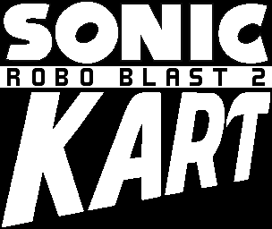

# SRB2Kart Web

[SRB2Kart](https://srb2.org/mods/) is a kart racing mod based on the 3D Sonic the Hedgehog fangame [Sonic Robo Blast 2](https://srb2.org/), based on a modified version of [Doom Legacy](http://doomlegacy.sourceforge.net/).

[SRB2Kart Web](https://kartweb.gvbvdxx.me) is a port of [SRB2Kart](https://srb2.org/mods/) to WASM (Emscripten) to play in web browsers.

## Disclaimer

Kart Krew is in no way affiliated with SEGA or Sonic Team. We do not claim ownership of any of SEGA's intellectual property used in SRB2.

## AI Usage Note

This project (mostly C related stuff and bash scripts) is helped with AI.
This doesn't mean that I didn't build anything at all, since I still wrote the launcher page and [relay server](https://github.com/gvbvdxxalt2/SRB2Web-relay) used for this game.

## Compilation

This is the exact same as [SRB2web's readme](https://github.com/gvbvdxxalt2/SRB2web), but it only works on Linux or WSL (Windows Subsystem for Linux).

### Requirements

* Node.JS (Latest should be fine)
* NPM (Should be included with Node JS by default)
* `sudo apt install git cmake build-essential python3` (Compilation dependencies)

### Get Game Assets

SRB2KartWeb uses very large files for it's resources, making it difficult to upload them directly into the github repo, so you must manually run `./get-assets.sh`, this should create an directory called `game-assets`.

### Install dependencies for launcher

SRB2KartWeb is two separate parts for the site (located in `launcher-src`) and the game (located in `src`). To install the dependencies for the launcher use `npm install`.

### Compile Emscripten WASM

This is usually skippable if you already have `build-wasm/bin/srb2kart.js` and `build-wasm/bin/srb2kart.wasm` already, but if you plan to modify the game's code or compile your own, you can use `./setup-build.sh` for the very first build and then `./build-wasm.sh` for every build once `./setup-build.sh` completes.

### Build launcher

Once you have obtained `build-wasm/bin/srb2kart.js` and `build-wasm/bin/srb2kart.wasm`, you can run `npm run build` to build the launcher, but if you plan to edit the launcher, instead of rebuilding every time you can use `npm run start` to start up a http server on `http://localhost:3000/` that automatically rebuilds every time you edit the launcher's code.

> [!NOTE]
> If you plan to play the build you must use a http server or host it on a website.
> This is because browsers don't give programmable access to files on `file://` URLs.